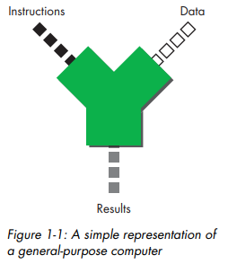
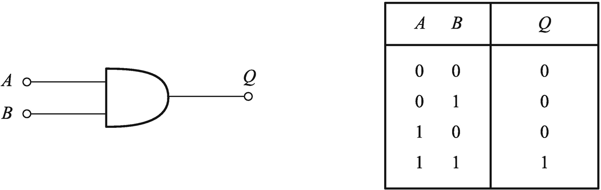
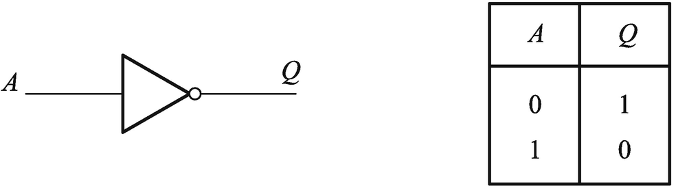
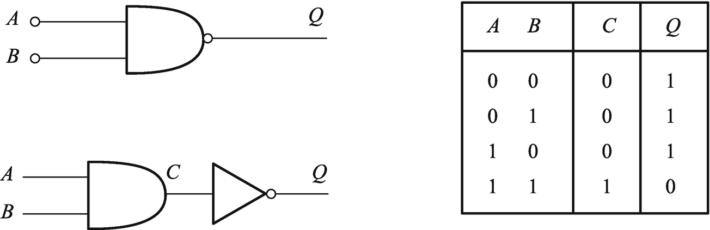
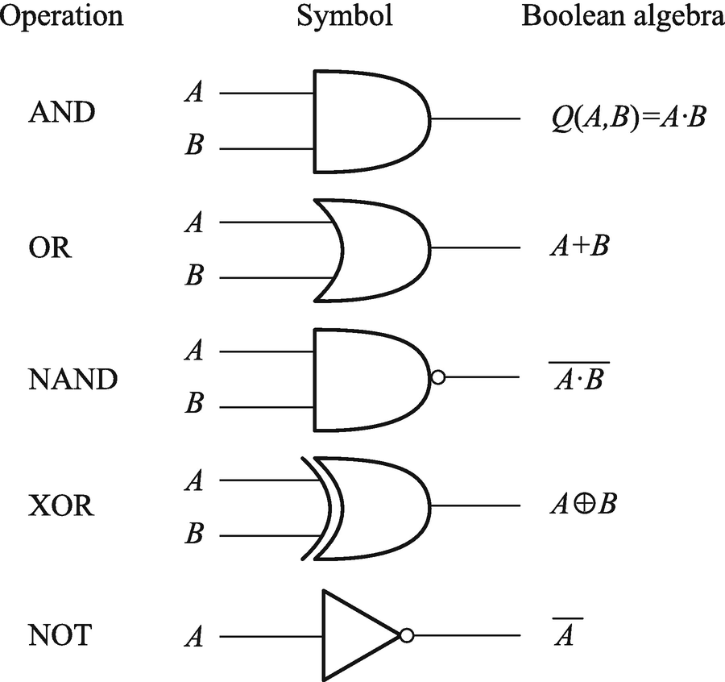

The Calculator Model of Computing

The Calculator Model of Computing is one of the most basic conceptual models used to understand how computation works. It focuses on the step-by-step execution of arithmetic and logical operations, similar to how a simple calculator operates.

Logic Functions and Truth Tables

